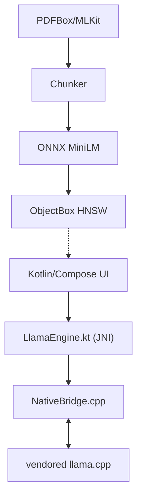

# PhoneLM: Offline Pocket AI

> A native Android LLM application running GGUF models via a custom C++/llama.cpp JNI bridge, featuring on-device RAG and an accessibility agent loop.

## 🟢 Current Status

> **🟢 M1 Build-Level Complete** — Real C++ decode loop compiled, 19 JVM tests passing.
> **🟡 Awaiting runtime emulator verification** to unlock M2 (Real RAG).
>
> Honesty is key for portfolios: the build is green, the native bridge is real, and the next milestone is gated on a human confirming the MANUAL_VERIFY §B real-generation gate on an emulator (`generateCompletion` must not return the fake placeholder).

See [docs/STATUS.md](docs/STATUS.md) for the live dashboard and [docs/MANUAL_VERIFY.md](docs/MANUAL_VERIFY.md) for the checklist the human runs.

---

## Ecosystem Context

PhoneLM does not train its own foundation model. It consumes the **model brain curated by [ForestControl](https://huggingface.co/LateMonk/ForestControl_Models)** and will track ForestControl's manifest when it stabilizes (see [docs/DECISIONS.md — D7](docs/DECISIONS.md#d7--modeldownloader-parked)). The LateMonk/PhoneLM_Models repo (Qwen3-1.7B, SmolLM2-1.7B, MiniLM ONNX) was audited in [docs/RESEARCH_NOTES.md §R5](docs/RESEARCH_NOTES.md); the M1 bundled model is a public Qwen2.5-0.5B GGUF chosen for size and llama.cpp tool-calling compatibility.

The project shares the **local-first thesis with [OpenTrae](https://github.com/anomalyco/opencode)** — an offline-first agent that keeps private memory on-device and treats the cloud as an optional sync target, not a runtime dependency.

---

## Architecture

### Layer diagram



The application can resolve its required GGUF/ONNX models via an external manifest contract or local asset bundling.

### How the layers connect

| Layer | Lives in | Talks to next layer via |
|-------|----------|------------------------|
| Compose UI | `app/src/main/java/com/phonelm/ui/` | `ChatViewModel` StateFlow |
| ViewModel + RAG wiring | `viewmodel/ChatViewModel.kt` | `LlamaEngine` object + `VectorStore` |
| JNI contract | `core/LlamaEngine.kt` (`external fun`) | JNI symbols in `NativeBridge.cpp` |
| Native bridge | `app/src/main/cpp/NativeBridge.cpp` | llama.cpp C API (`llama.h`) |
| Inference | `app/src/main/cpp/llama.cpp/` (vendored, gitignored per D9) | GGUF on disk |

- **JNI contract table, call-by-call status, and the fake-vs-real inventory:** [docs/CODEBASE_MAP.md](docs/CODEBASE_MAP.md).
- **Why llama.cpp was vendored and ignored (not submoduled), with pinned provenance hash:** [docs/DECISIONS.md — D9](docs/DECISIONS.md#d9--git-baseline-init-repo-at-root-vendored-llamacpp-ignored-supervisor-directed) and [docs/RESEARCH_NOTES.md](docs/RESEARCH_NOTES.md).
- **Deep dive — `NativeBridge.cpp`, sampler chain, EOG stop, D4 asset flow:** [docs/ARCHITECTURE.md](docs/ARCHITECTURE.md).

---

## Build Instructions

### Prerequisites

| Tool | Version (pinned) | Notes |
|------|-------------------|-------|
| Android Studio | Hedgehog or newer |  |
| JDK | 17 (Microsoft 17.0.17) | `JAVA_HOME` must point to JDK 17 |
| Android SDK | compileSdk 34, targetSdk 34 |  |
| NDK | **26.1.10909125** | pinned in `app/build.gradle.kts:ndkVersion` |
| CMake | **3.22.1** | pinned in `app/build.gradle.kts:externalNativeBuild.cmake.version` |
| Gradle wrapper | **8.6** | pinned per D1; do not upgrade AGP/Kotlin without supervisor approval |

### Crucial Step — the GGUF model is gitignored

The model is **never committed**. `app/src/main/assets/models/` is ignored (see [.gitignore](.gitignore) and [D4](docs/DECISIONS.md#d4--bundled-model-mechanism-scripted-copy-gitignored-asset)). Fetch it with the script before building if you need on-device inference:

```powershell
# Download Qwen2.5-0.5B-Instruct Q4_K_M (~468 MB) from Hugging Face into assets
.\scripts\fetch_model.ps1

# Or copy a local GGUF you already have
.\scripts\fetch_model.ps1 -SourcePath C:\path\to\your\model.gguf
```

The script is idempotent, validates the file size, and is documented in [docs/DECISIONS.md — D4](docs/DECISIONS.md#d4--bundled-model-mechanism-scripted-copy-gitignored-asset). `assembleDebug` succeeds with or without the file; without it the app shows a clean "no model loaded" state (see [docs/MANUAL_VERIFY.md](docs/MANUAL_VERIFY.md)).

### Build

```powershell
.\gradlew.bat assembleDebug          # debug APK at app/build/outputs/apk/debug/app-debug.apk
# With the GGUF present the APK is ~507 MB (38 MB app + 468 MB asset)
```

---

## Testing

### JVM unit tests (agent-runnable, 19 tests)

```powershell
.\gradlew.bat testDebugUnitTest
```

| Suite | File | What it proves |
|-------|------|----------------|
| Chunker | `rag/ChunkerTest.kt` (7 tests) | paragraph-aware chunking, hard-wrap cap, no chunk exceeds `maxChars`, char-count preservation |
| PromptBuilder | `rag/PromptBuilderTest.kt` (5 tests) | RAG context-block formatting, ordering, multiline verbatim, special-char passthrough |
| ModelLocator | `core/ModelLocatorTest.kt` (7 tests) | `.gguf` validation, empty-dir handling, largest-wins resolution |

The anti-fake guarantee for embeddings (same input → identical 384-dim vector) is an **instrumented** gate scheduled for M2 (see below); JVM tests do not cover `getEmbeddings` while it is parked per D2.

### Instrumented smoke test (user runs on emulator)

```powershell
.\gradlew.bat connectedDebugAndroidTest   # or: connectedAndroidTest
# Runs app/src/androidTest/java/com/phonelm/JniSmokeTest.kt
```

`JniSmokeTest` copies the bundled asset GGUF to `filesDir`, calls `LlamaEngine.loadModel` → `generateCompletion("Say hello…")`, and **fails if the response still contains the fake placeholder** `Native inference placeholder`. That single assertion is the anti-fake gate that permanently kills the `NativeBridge.cpp:generateCompletion` stub. The test `Assume`s the model asset exists and skips (not fails) when it does not, so model-less CI stays usable.

Full manual protocol (install, cold launch, no-model state, model load, real generation, embedding determinism, logcat sanity) lives in [docs/MANUAL_VERIFY.md](docs/MANUAL_VERIFY.md).

---

## Roadmap

| Milestone | Scope | Status |
|-----------|-------|--------|
| **M1 — Basic working** | real decode loop; CPU fallback (`n_gpu_layers=0`); Gradle + resources fixed; bundled-GGUF mechanism; 19 JVM tests + JNI smoke template; `assembleDebug` green with/without model | **✅ Build-level complete** |
| **M2 — Real RAG** | real MiniLM WordPiece tokenizer + ONNX inference (384-dim, deterministic), sentence-boundary chunking wired, ObjectBox retrieval with citations | Planned — see [docs/PLAN.md](docs/PLAN.md) |
| **M3 — Agent loop** | grammar/JSON-schema constrained tool calls replacing the regex at `ChatViewModel.kt:134`, AccessibilityService confirm-before-act UX | Planned |
| **M4 — Model UX** | streaming token UI, stop-generation, model manager, ForestControl-manifest-driven ModelDownloader | Planned |
| **M5 — Quality** | benchmarks, battery guardrails, release signing, AGP/Gradle modernization (own STOP-AND-ASK plan) | Planned |

M1+M2 is the v1 scope. Constraints and per-milestone DoD in [docs/PLAN.md](docs/PLAN.md); decisions with alternatives in [docs/DECISIONS.md](docs/DECISIONS.md).

---

## Docs Index

| Doc | Purpose |
|-----|---------|
| [docs/CODEBASE_MAP.md](docs/CODEBASE_MAP.md) | audited file tree, JNI contract, fake/broken inventory, build-system diagnosis |
| [docs/RESEARCH_NOTES.md](docs/RESEARCH_NOTES.md) | sourced findings: decode loop, pooling, PR #9639, sqlite-vec, HF repo audits |
| [docs/DECISIONS.md](docs/DECISIONS.md) | numbered decisions D1–D10 with rejected alternatives |
| [docs/PLAN.md](docs/PLAN.md) | M1–M5 milestones + Phase-2 self-review cuts |
| [docs/ARCHITECTURE.md](docs/ARCHITECTURE.md) | deep dive: NativeBridge.cpp, sampler chain, D4/D9 mechanisms |
| [docs/STATUS.md](docs/STATUS.md) | live health dashboard — must never contradict PROGRESS.md |
| [docs/PROGRESS.md](docs/PROGRESS.md) | append-only per-step reflections + Step 5 Decode Plan |
| [docs/TEST_LOG.md](docs/TEST_LOG.md) | verbatim command evidence per step |
| [docs/BLOCKERS.md](docs/BLOCKERS.md) | honest blocker log |
| [docs/MANUAL_VERIFY.md](docs/MANUAL_VERIFY.md) | user-run emulator/device checklist + anti-fake gates |
